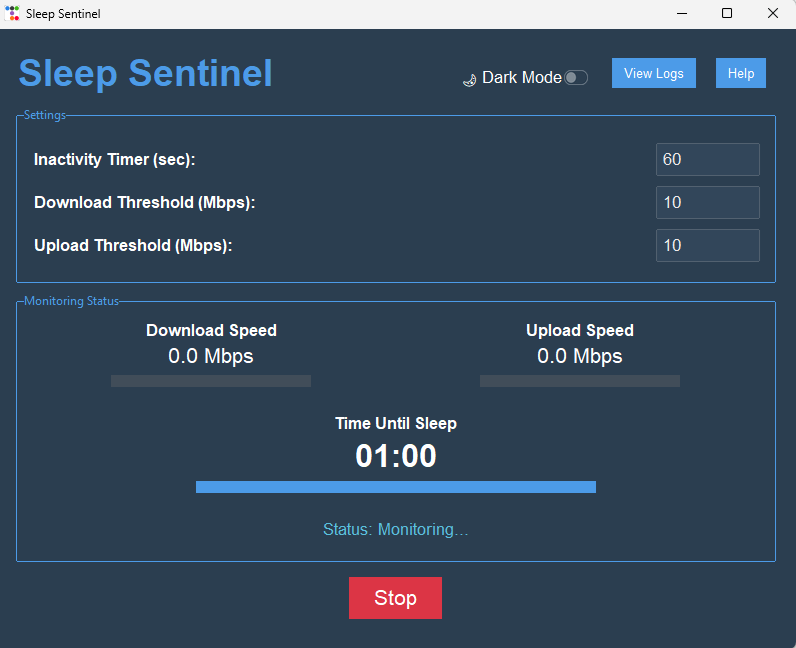

# Sleep Sentinel

Sleep Sentinel is a Python application that monitors network activity and prevents your system from sleeping during active usage. It allows you to set custom thresholds for download/upload speeds and an inactivity timer to automatically put your system to sleep when not in use.

 <!-- Add a screenshot of your application here -->

---

## 🚀 Features

- **Network Speed Monitoring**: Tracks download and upload speeds in real-time.
- **Inactivity Timer**: Automatically puts the system to sleep after a period of inactivity.
- **Customizable Thresholds**: Set custom thresholds for download/upload speeds to keep the system awake during active usage.
- **Modern GUI**: Built with `ttkbootstrap` for a sleek and user-friendly interface.
- **Cross-Platform**: Works on Windows, macOS, and Linux.

---

## 🛠 Requirements

- Python 3.x
- Libraries: `psutil`, `pynput`, `ttkbootstrap`, `Pillow`

---

## 📦 Installation

1. Clone this repository:
   ```sh
   git clone https://github.com/mabubakar87/SleepSentinel.git
   cd SleepSentinel
   ```

2. Create a virtual environment (optional but recommended):
   ```sh
   python -m venv venv
   ```

3. Activate the virtual environment:
   - **Windows:**
     ```sh
     venv\Scripts\activate
     ```
   - **macOS/Linux:**
     ```sh
     source venv/bin/activate
     ```

4. Install the required dependencies:
   ```sh
   pip install -r requirements.txt
   ```

---

## 🎯 Usage

1. Run the application:
   ```sh
   python main.py
   ```
2. Set the following parameters in the GUI:
   - **Inactivity Timer**: Time (in seconds) after which the system will sleep if inactive.
   - **Download/Upload Thresholds**: Minimum network speeds (in Mbps) to keep the system awake.
3. Click **Start** to begin monitoring.

---

## ⚙️ Configuration

You can customize the default settings by modifying the following constants in the code:

- `DEFAULT_SPEED_THRESHOLD`: Default download/upload speed threshold (in Mbps).
- `DEFAULT_INACTIVITY_LIMIT`: Default inactivity time (in seconds).

---

## 📜 Logs

The application logs all activities to `log.txt` in the project folder. You can view the logs directly from the GUI by clicking **View Logs**.

---

## 🤝 Contributing

Contributions are welcome! If you'd like to contribute, please follow these steps:

1. Fork the repository.
2. Create a new branch for your feature or bug fix.
3. Commit your changes.
4. Submit a pull request.

---

## 📄 License

This project is licensed under the MIT License. See the [LICENSE](LICENSE) file for details.

---

## 🙌 Acknowledgments

- Built with `ttkbootstrap` for the modern GUI.
- Uses `psutil` for network monitoring.
- Inspired by the need to prevent system sleep during active network usage.

---

## 📬 Contact

For questions or feedback, feel free to reach out:

- **GitHub**: [mabubakar87](https://github.com/mabubakar87)

